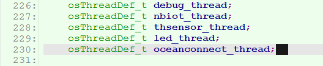
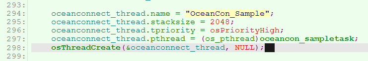
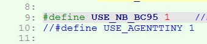

## 背景说明

	项目：1-nbiot-liteos-oceanconnect
	网络：NB-IoT
	平台：OceanConnect

- 源代码下载：
[LiteOS_ThunderSoft_STM32FL476VETx.rar](../code/LiteOS_ThunderSoft_STM32FL476VETx.rar)

## 注意事项
#### 关于启用oceancon_sampletask任务。

- 打开1-nbiot-liteos-oceanconnect项目。
- 打开miniprojects\LiteOS_ThunderSoft_STM32FL476VETx\USER\main.c文件。
- 第230行。



- 第294行 到 298行。



- OceanConnect任务函数是 oceancon_sampletask。

#### 关于启用NB-IoT功能。

- 打开\miniprojects\LiteOS_ThunderSoft_STM32FL476VETx\TESTS\ocean_sample.c文件。
- 第9行。注释掉第10行。



#### 关于设置OceanConnect平台IP、端口号。
有2个设置方法。


- 方法1：手动设置。
根据帖子 *【零代码】利用已有Demo快速体验NB-IoT全流程(NB模组篇)* 
[http://developer.huawei.com/ict/forum/thread-25005.html](http://developer.huawei.com/ict/forum/thread-25005.html) 
一步一步手动调试NB-IoT模块，调试过程中即可完成平台IP、端口号的设置。 
```
Step 4：执行“AT+NCDP=IP, PORT”设置需要对接IoT平台的地址、端口。如果执行成功，返回OK。 
```
- 方法2：程序设置。
目前未在代码中实现，可自由添加。
