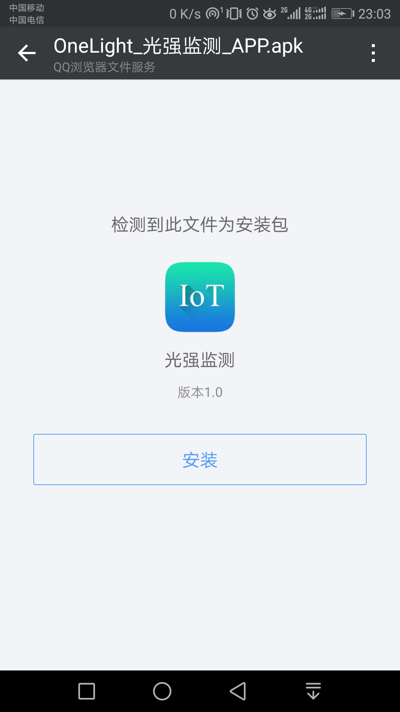
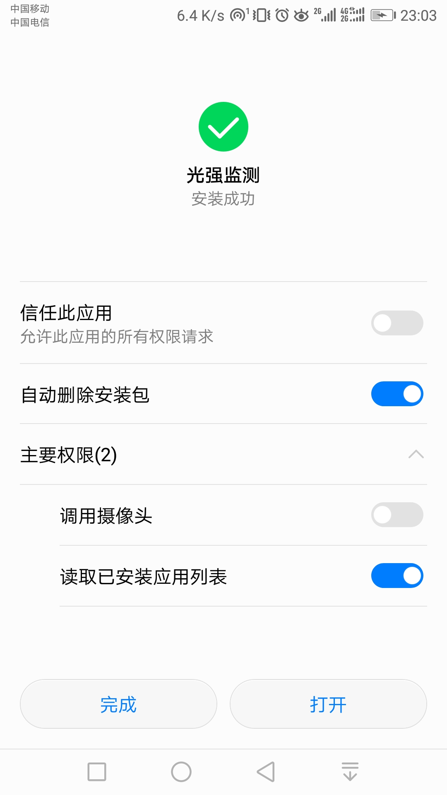
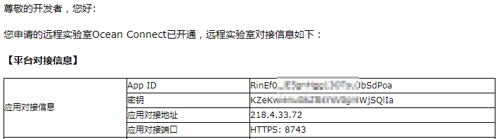
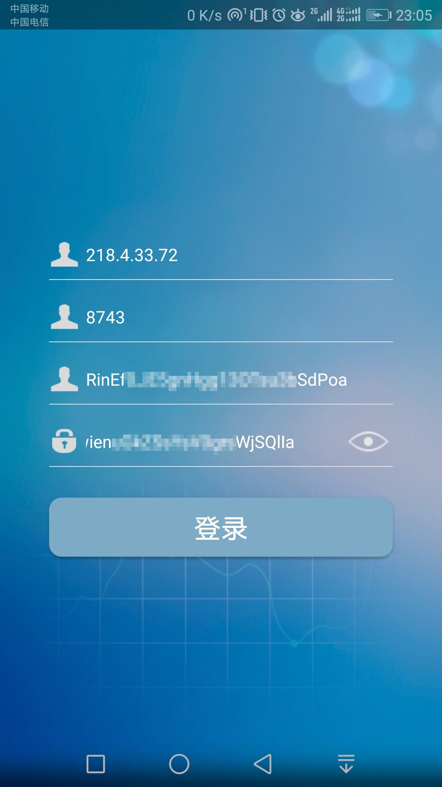
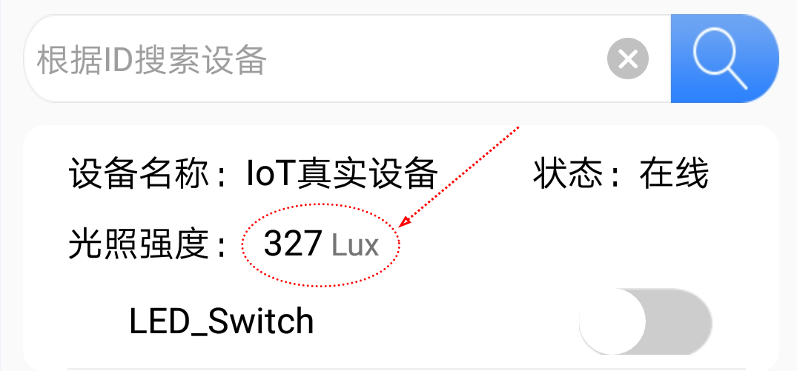
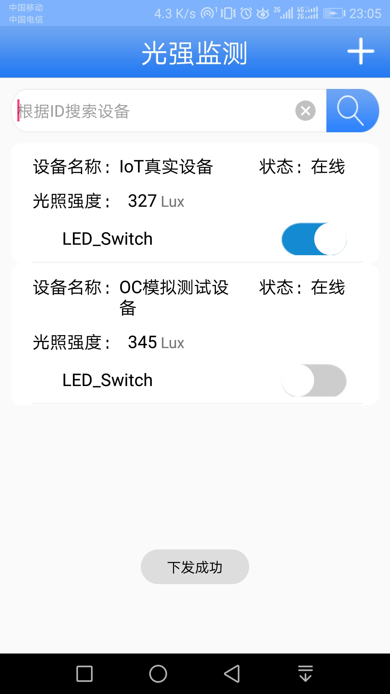
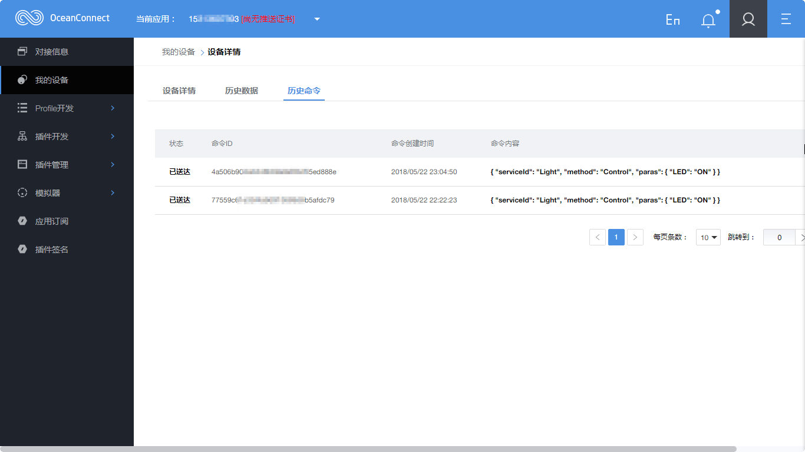
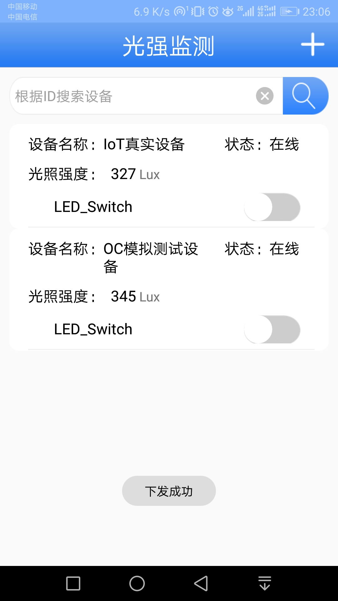
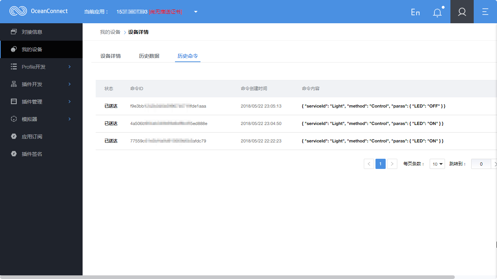

## 背景说明

	体验OneLight手机APP

## 体验OneLight手机APP

* [1.获取手机APP](#1)
* [2.安装APP](#2)
* [3.登陆APP](#3)
* [4.APP实时显示数据](#4)
* [5.APP下发命令](#5)
* [6.手机APP源代码下载地址](#6)

<h3 id="1">1.获取手机APP</h3>

	华为IoT开发者生态峰会LiteOS_NB-IoT_OceanConnect
	链接：https://pan.baidu.com/s/1bIo0hkfgy_KWQx_Xi_BX3Q 
	密码：lyyh
	【注意】下载手机APP软件。

<h3 id="2">2.安装APP</h3>

<h3 id="3">3.登陆APP</h3>

- 注意：根据OceanConnect账号邮件的内容来填写。

<h3 id="4">4.APP实时显示数据</h3>

<h3 id="5">5.APP下发命令</h3>

<h3 id="6">6.手机APP源代码下载地址</h3>

	华为IoT开发者生态峰会LiteOS_NB-IoT_OceanConnect
	链接：https://pan.baidu.com/s/1bIo0hkfgy_KWQx_Xi_BX3Q 
	密码：lyyh
	【注意】下载APP源代码。

- 至此，完成体验OneLight手机APP。

