## 背景说明

	抛开繁琐的文档，来跟我一起快速开发吧。
	平台：OceanConnect开发者平台 IP 117.78.47.187
	网络：NB-IoT
	硬件：钛比科技

## 开发步骤

* [1.登陆平台](#1)
* [2.制作profile](#2)
* [3.在线生成编解码插件](#3)
* [4.注册设备](#4)
* [5.调试设备](#5)

<h3 id="1">1.登陆平台</h3>

	浏览器：chrome 【推荐】
	OceanConnect平台登陆IP：117.78.47.187
	浏览器登陆端口：8093
	
	南北向登陆IP：117.78.47.187
	北向接入端口：8743（HTTPS）
	南向接入端口1：5683 NB-IoT不加密 （推荐）(COAP / UDP)
	南向接入端口2: 5684  NB-IoT加密 (COAP / UDP / DTLS)

	SoftRadio对接地址：117.78.47.187
	SofrRadio对接端口：8080

- 登陆开发者portal用户名、密码。

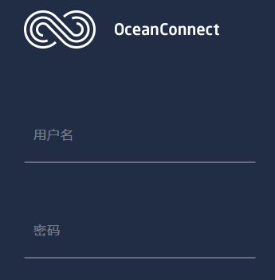

- 选择你要集成的设备：NB-IoT设备。点击“开始”。

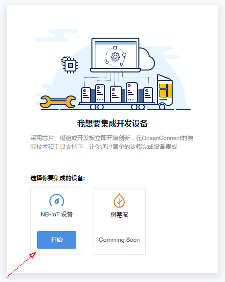

- 准备工作完成。

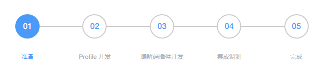

<h3 id="2">2.制作profile</h3>

- 现在开始进入Profile开发阶段。

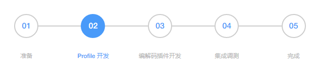

- 点击链接 [动手实验室_制作OneButton的profile](./动手实验室_制作OneButton的profile.md)

<h3 id="3">3.在线生成编解码插件</h3>

- 开始在线生成编解码插件。

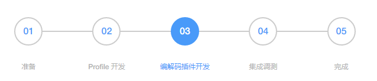

- 点击链接 [动手实验室_在线制作OneButton的编解码插件](./动手实验室_在线制作OneButton的编解码插件.md)

<h3 id="4">4.注册设备</h3>

- 点击导航栏，我的设备。点击注册设备。

- 选择需要注册设备的profile。

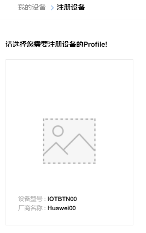

- 填写设备标识码。注意一定要唯一。NB-IoT模块填写IMEI号。

- 咱们一共需要注册2个设备。1个是模拟测试用的，设备标识码按时间来写。第2个是真实的OneButton设备，需要注册NB-IoT模块的IMEI号。

- 目前只需要创建模拟测试用设备。

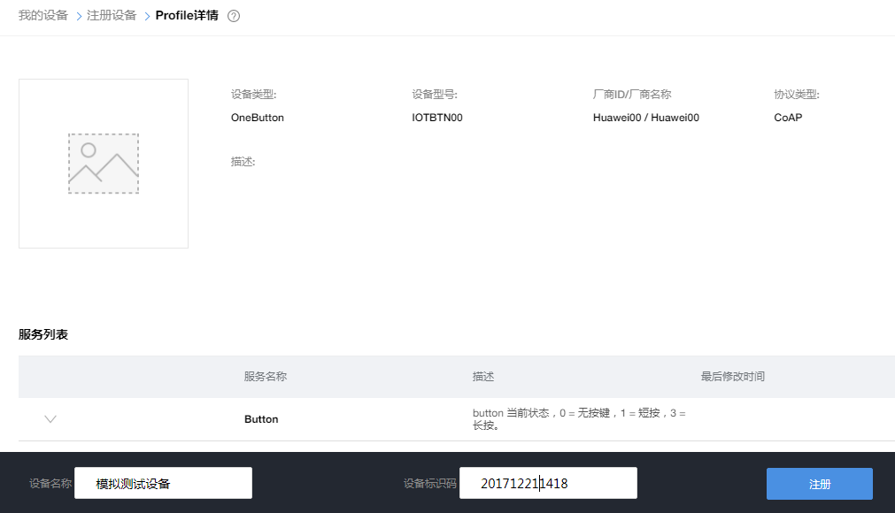

- 注册设备成功。系统给出设备ID，PSK码。

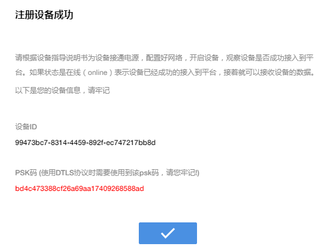

- 目前设备处于OFFLINE状态。

- 历史数据为空。设备注册到此结束。

<h3 id="5">5.调试设备</h3>

- 导航栏点击NB设备模拟器。点击绑定设备。

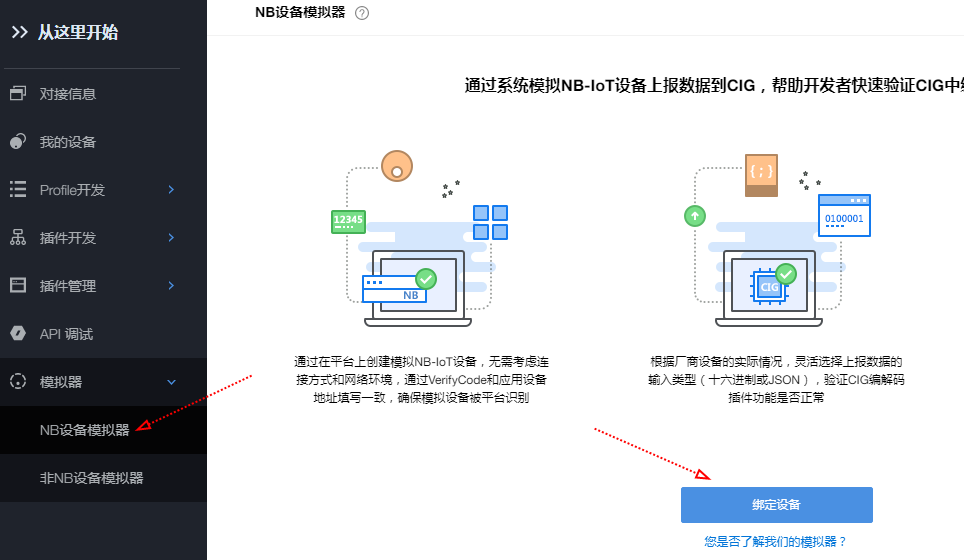

- 选择不加密方式。加密与不加密的IP端口号，不一样。验证码填写，NB-IoT填写IMEI码。

- OneButton目前有三条数据消息，三条命令下发消息。

- BTN_DATA_RPT 消息。发送 00011801。码流内容【ButtonState: 1，tempValue:24，beepState:1 】

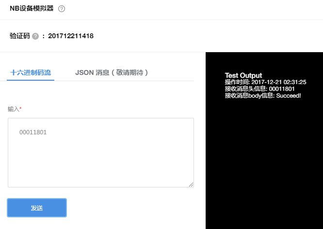

- 此时回到我的设备。可以看到设备已经ONLINE。而且可以下发命令。

- 历史数据收到 ButtonState: 1，tempValue:24，beepState:1。

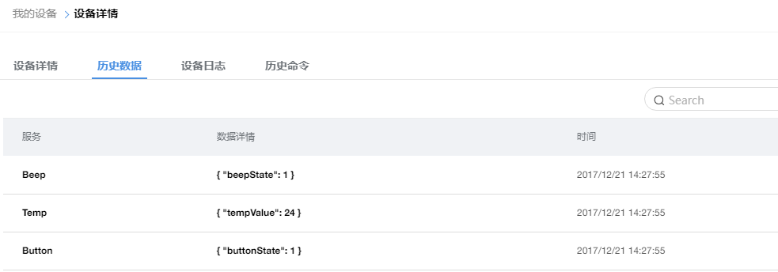

- EXT_DATA_RPT 消息。发送 0119005A019A4E51。码流内容【CSQ: 25，SNR: 90，CELLID: 26889809 】

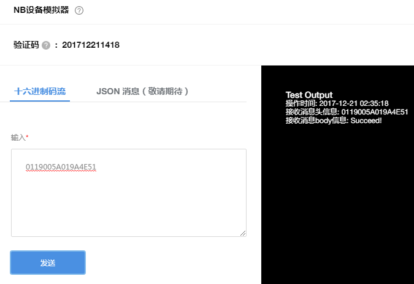
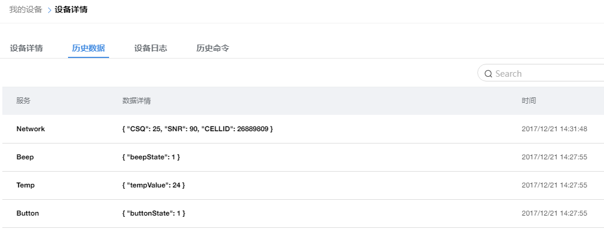

- ALARM_RPT 消息。发送 020100。码流内容【highTempAlarm:1, lowTempAlarm:0】

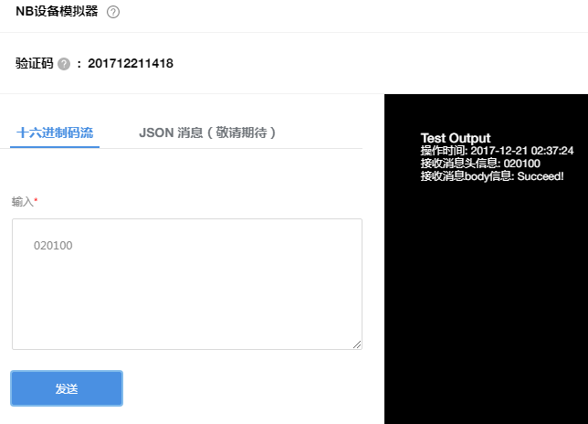
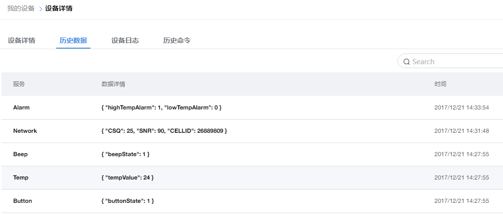

- SET_HIGHTEMP_TH 命令下发。

- SET_LOWTEMP_TH 命令下发。

- SET_BEEP_ON 命令下发。注意：程序中，下发数字 3 代表开启寻物响铃。

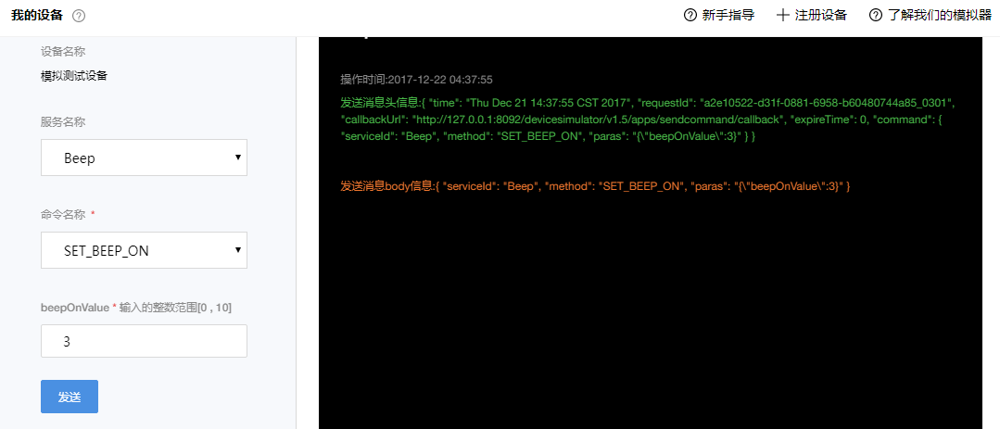
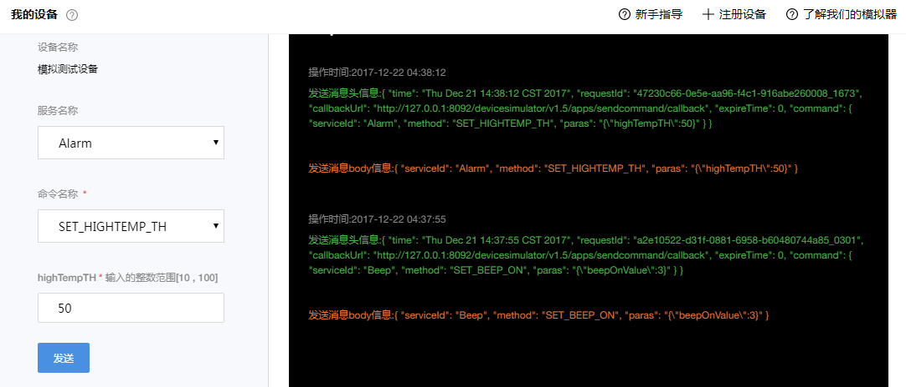
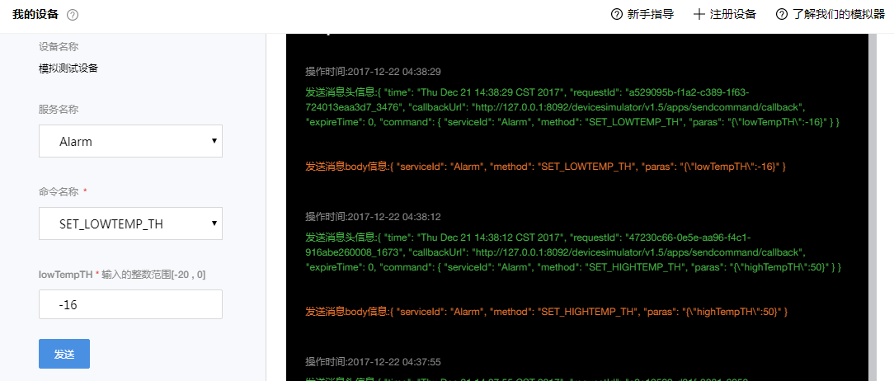
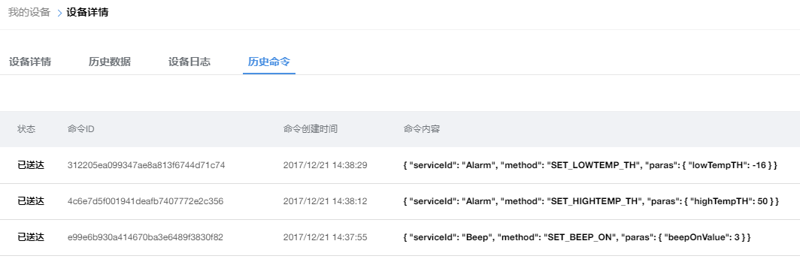

- 高阶用户可以查看设备日志，为后续自由定制更复杂的编解码插件而准备。

- 至此，成功地在OceanConnect平台进行了第一次开发。

