## 背景说明

	在线生成编解码插件。

- 点击链接 [编解码库开发与升级指南](http://developer.huawei.com/ict/cn/site-oceanconnect_doc?doc=oceanconnect_utility_portal%2Fzh-cn_topic_0072974881)  详细了解编解码插件。

## 开发步骤

- 点击插件开发。点击开始设计。

- 点击新建插件。下面有一些插件的模版，大家可以点进去查看参考，也可以基于模版直接进行开发。

- 选择profile文件。

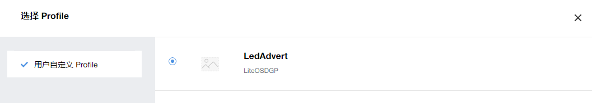

- 点击新增消息。

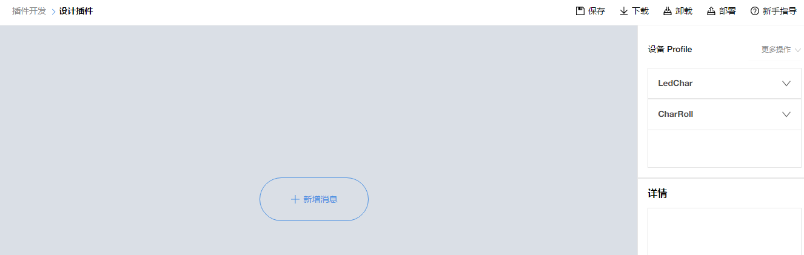

- 新建一个数据上报信息DevDataUp。就是LED广告牌主动上报，目前显示的字符、滚动状态。

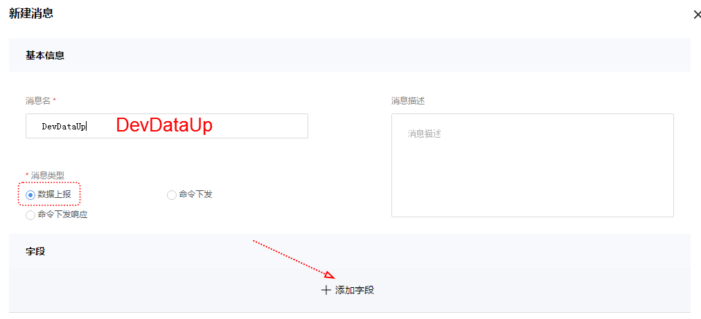

- 添加字段。报文头header。自由约定产品特性，就是LED广告牌每次上报数据，均以4个字节为报文头。

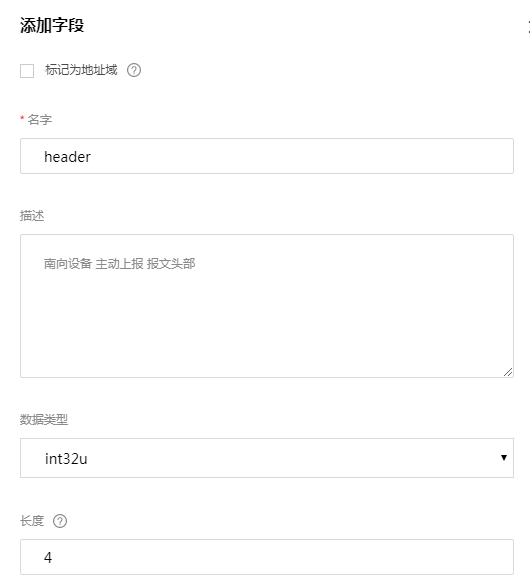
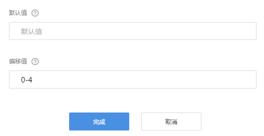

- 再添加一个字段 LedIndex。广告牌目前显示的字符序号。

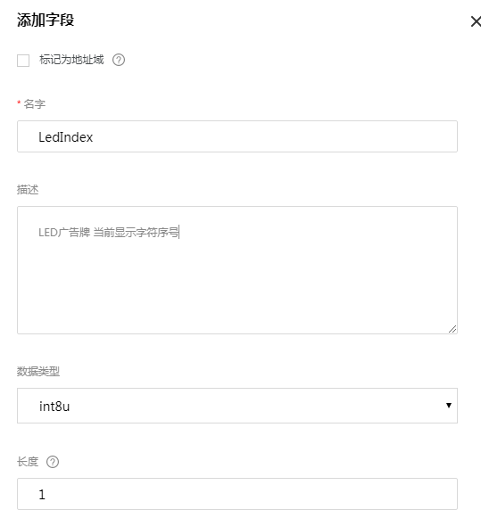
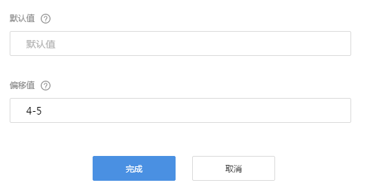

- 再添加一个字段 RollStatus。广告牌目前是否处于滚动状态。

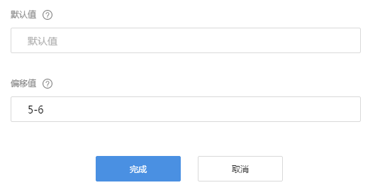

- 把profile文件的属性，拖到消息这边。注意属性与消息字段的对应关系。

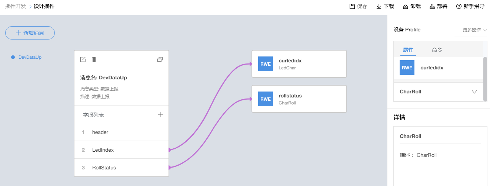

- 此时保存编解码插件。

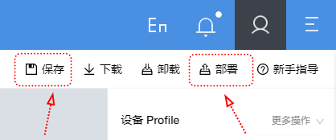

- 保存时的参数，默认自动设置。不需要修改。

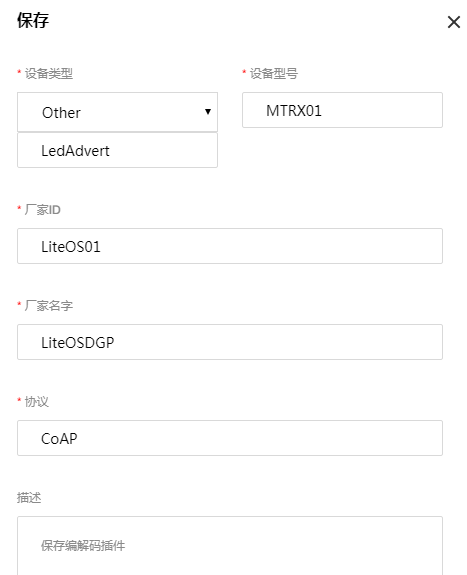

- 查看接插件保存结果。接入协议 CoAP。目前还没有部署。

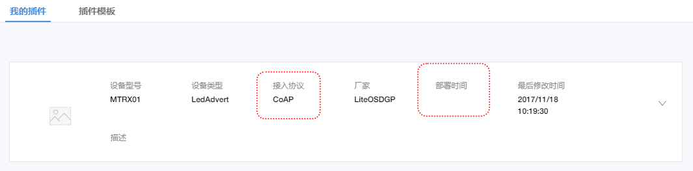

- 点击部署。

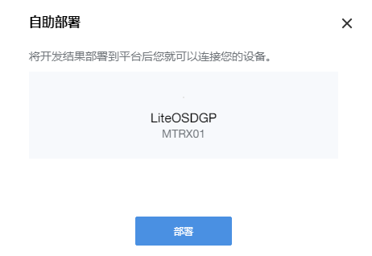

- 部署成功。

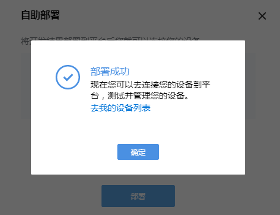

- 完成编解码插件的开发。

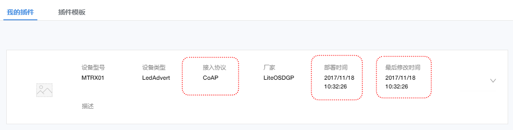

