## 背景说明

	如何才能快速获取OceanConnet平台账号呢？

## 获取账号步骤

* [1.注册华为开发者中心账号](#1)
* [2.进入远程实验室](#2)
* [3.OceanConnect平台账号申请](#3)
* [4.登陆OceanConnect平台](#4)
* [5.如果遇到问题，我该怎么办](#5)

<h3 id="1">1.注册华为开发者中心账号</h3>

	浏览器：chrome 【推荐】
	登陆网址  http://developer.huawei.com/ict/cn

- 点击链接 [http://developer.huawei.com/ict/cn](http://developer.huawei.com/ict/cn) 进入华为开发者中心。

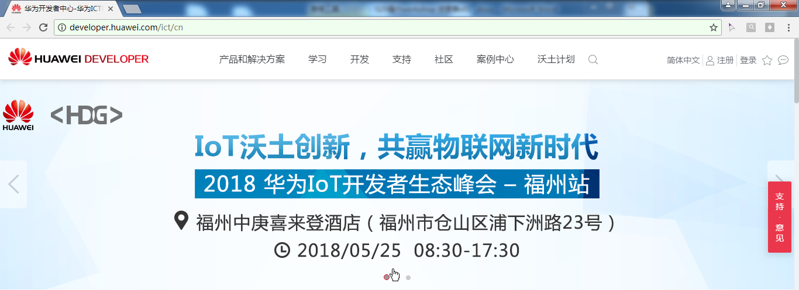

- 点击右上角，注册。

- 继续完善个人信息。

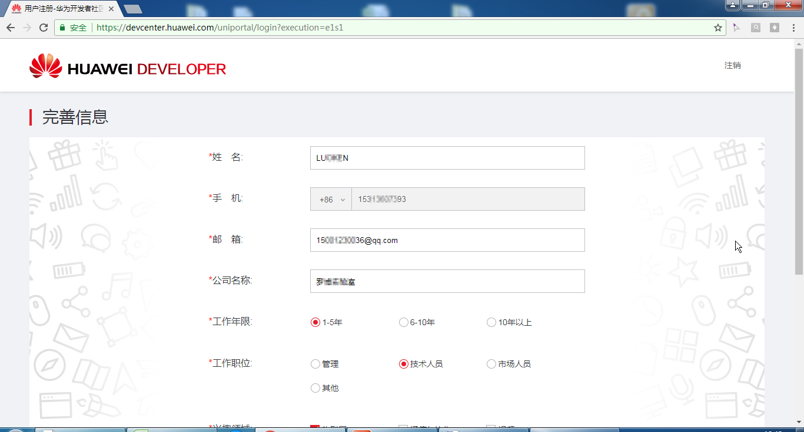
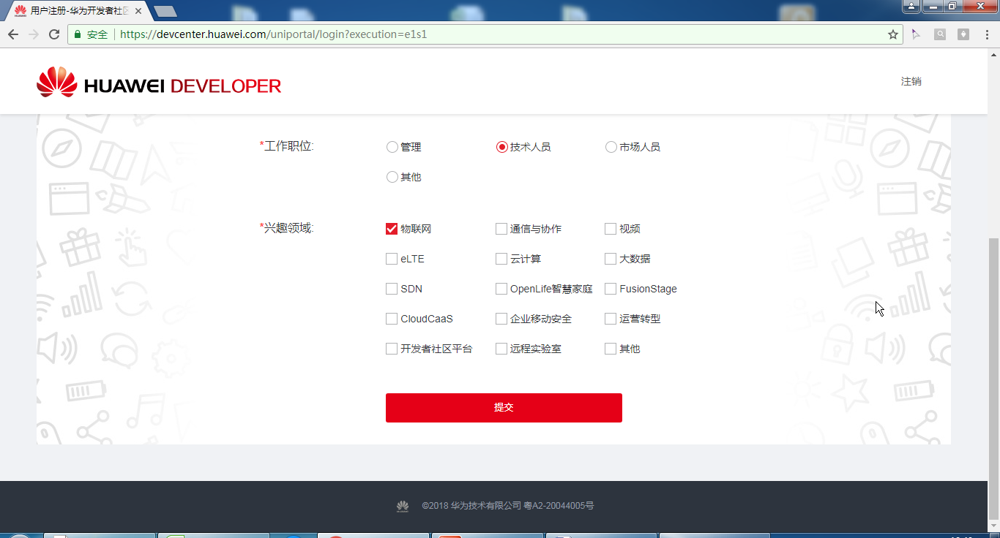

- 完成注册。

<h3 id="2">2.进入远程实验室</h3>

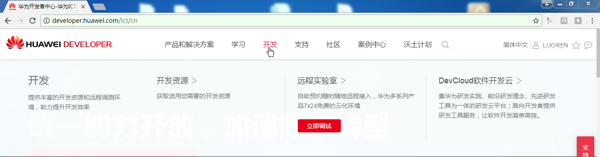
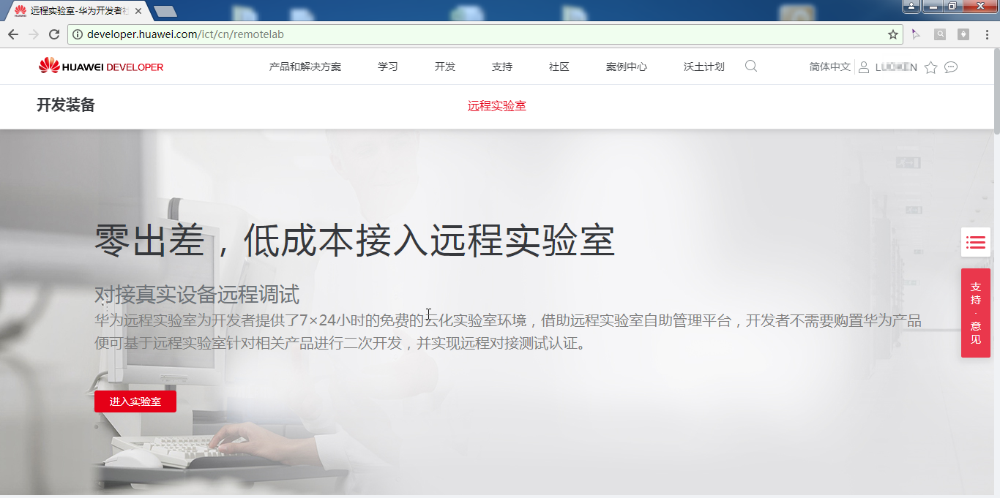

- 右下角选择，IoT。

- 或者直接点击链接  [OceanConnect平台账号申请，快速入口](http://esdkremotelab.huawei.com/RM/Diagram/Index/c5867e80-8459-49fb-949a-1e7416a0f8b8?diagramType=Topology) 

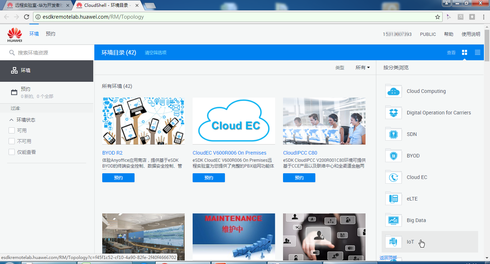
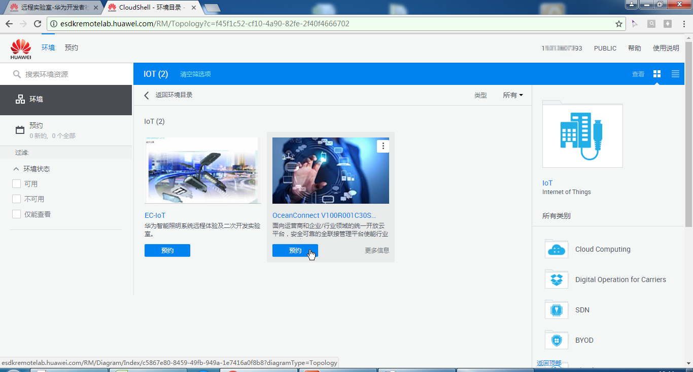

<h3 id="3">3.OceanConnect平台账号申请</h3>

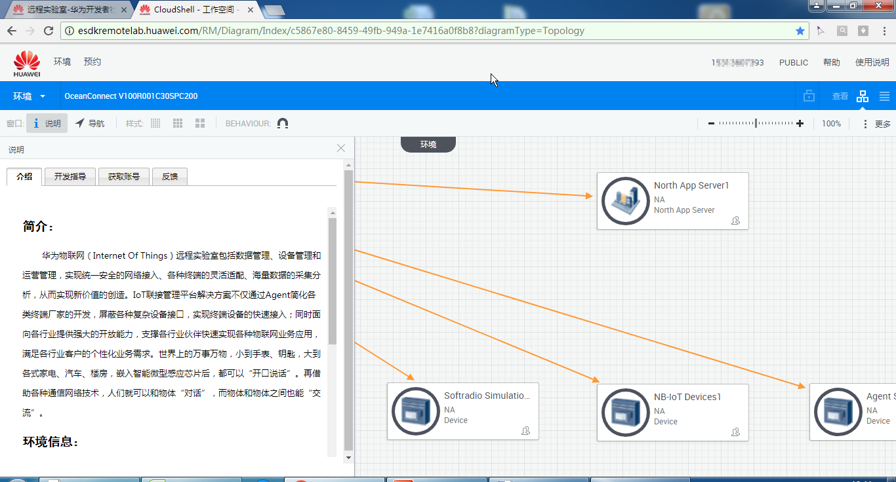
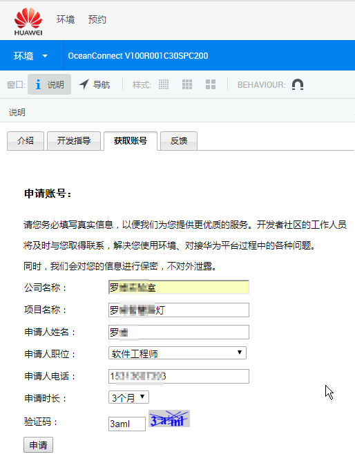

- 查看邮箱，可以收到账号信息。您预约的远程实验室环境“Ocean Connect”已开通！Your Huawei Remote Lab 'Ocean Connect' is Ready!

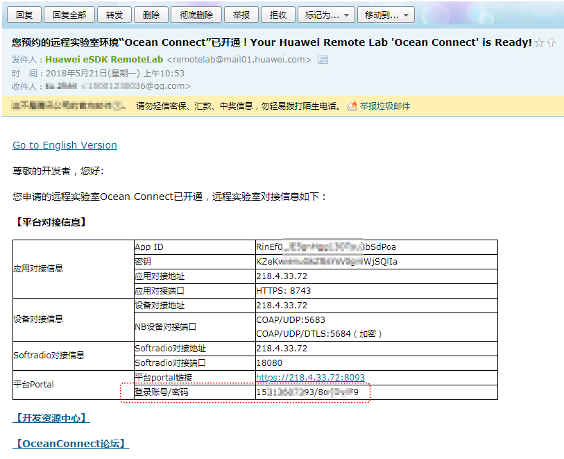

<h5 id="5">5.如果遇到问题，我该怎么办</h5>

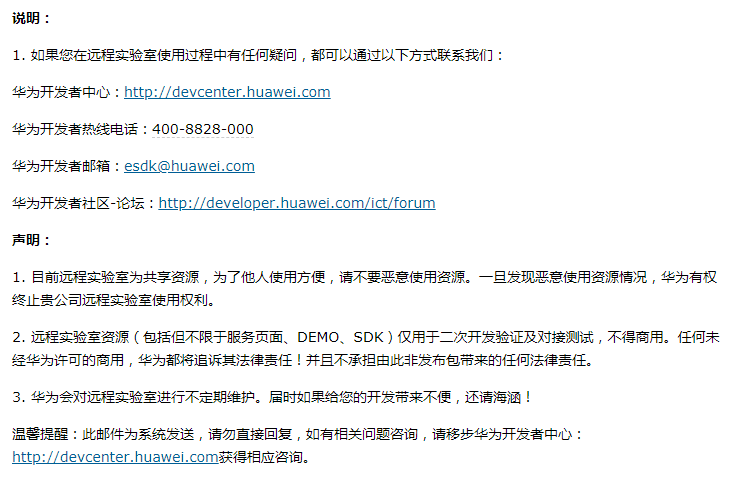

<h3 id="4">4.登陆OceanConnect平台</h3>

- 登陆OC平台。点击链接地址 [https://218.4.33.72:8093/](https://218.4.33.72:8093/) 进入平台。

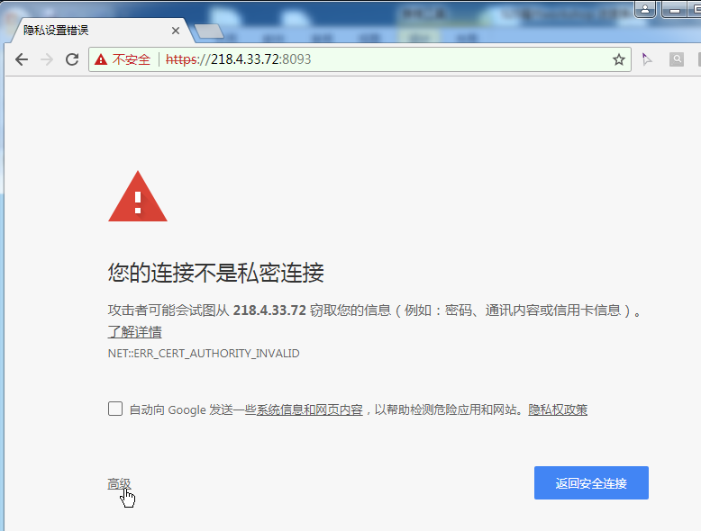
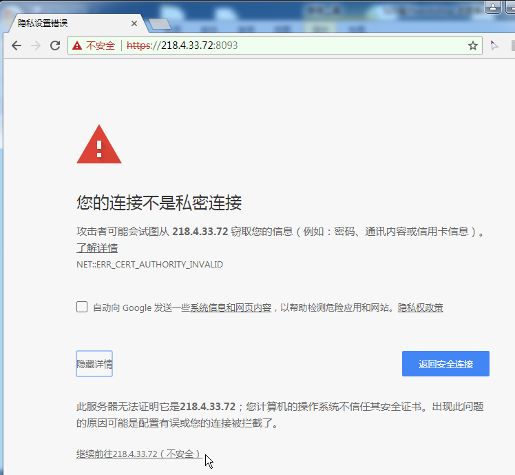
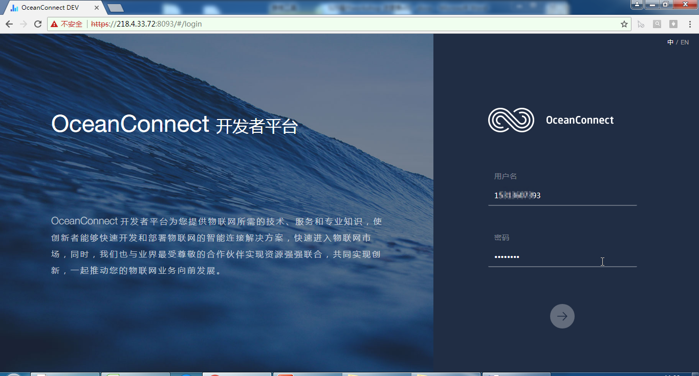
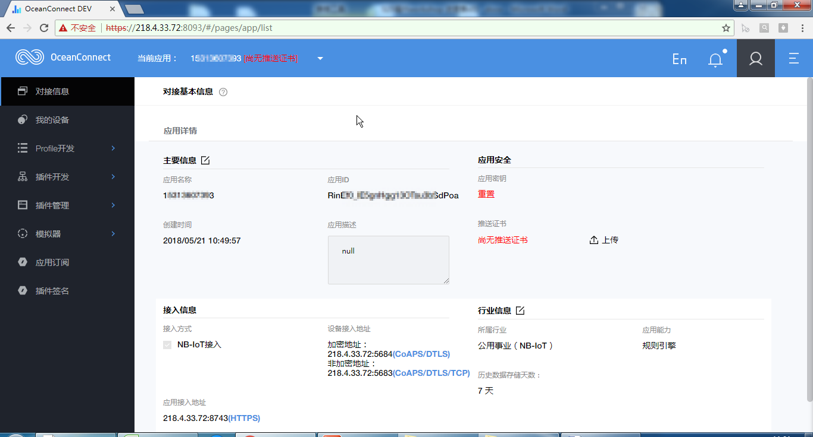

- 至此，成功地获取了OceanConnect平台的账号。

