## 背景说明

	快速开发设备profile。

## 开发步骤

* [1.制作profile](#1)
* [2.导入profile](#2)

<h3 id="1">1.制作profile</h3>

- 点击左侧导航栏。Profile开发 -> 产品。

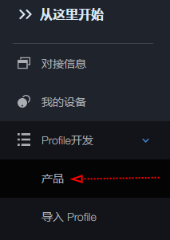

- 可以自定义产品，也可以直接导入Profile文件。点击“自定义产品”。

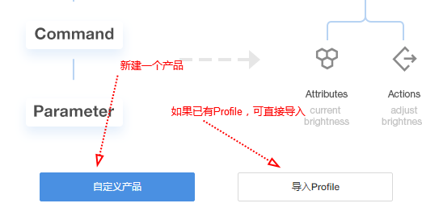

- 点击“创建全新产品”。

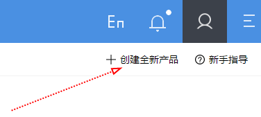

- 创建全新产品。设备类型，选 other，填入 LedAdvert（注意：关于产品类型、型号，大家也可以按照自己的想法来填写，此处仅仅是示范）。

- 定义一款产品：LED广告牌。它可以显示字符，可以有滚动效果。IoT平台可下发命令，显示某个字符，也可控制是否滚动。此LED广告牌主动向IoT平台上报，它目前显示的字符，是否滚动。

- 其他选项，请依据红色提示字符依序填入。

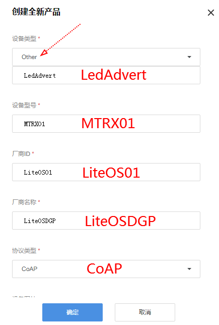

- 点击确定后，添加产品成功！

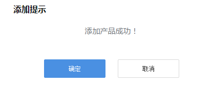

- 在我的产品中，有新添加的产品。点击此产品。

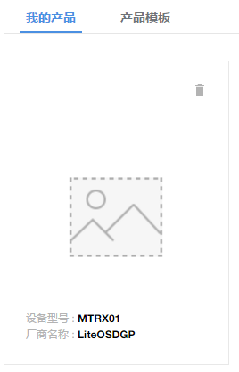

- 右下角点击“新建服务”。服务是描述了产品是什么、能做什么以及如何控制该产品的信息。
- 点击链接 [设备profile文件](http://developer.huawei.com/ict/cn/site-oceanconnect_doc?doc=oceanconnect_dev_overview_portal%2Fzh-cn_topic_0073931585) 查看更详细介绍。

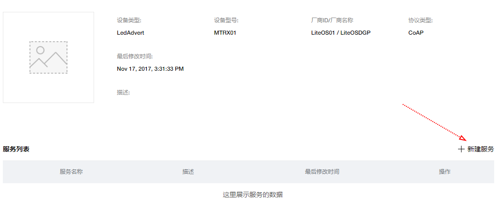

- 服务名：LedChar。点击“新增属性”。属性是对这项服务进行详细参数定义。

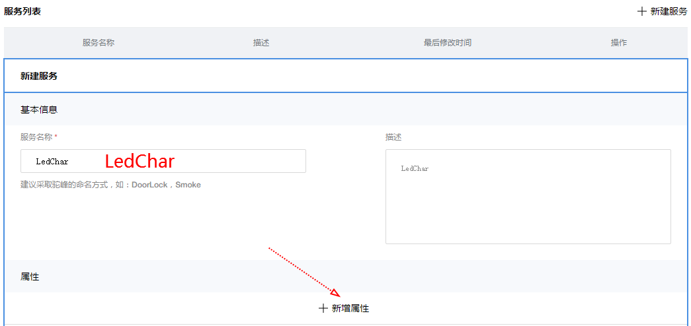

- 定义当前显示哪一个字符。属性名：curledidx(示例命名)。有0 ~ 35 个字符可以显示。

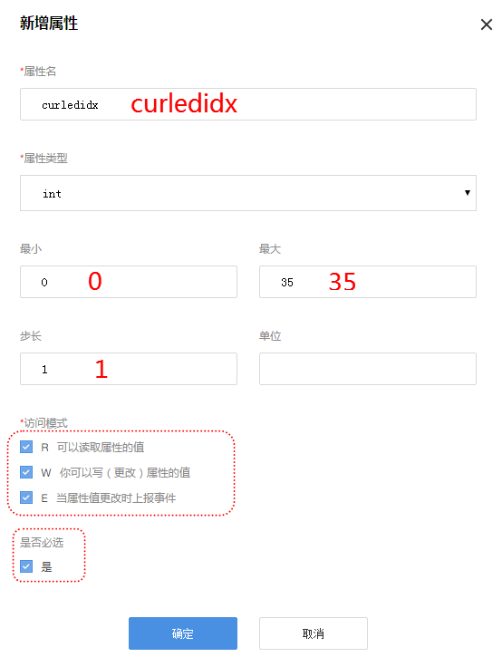

- 确定后，点击“新增命令”。

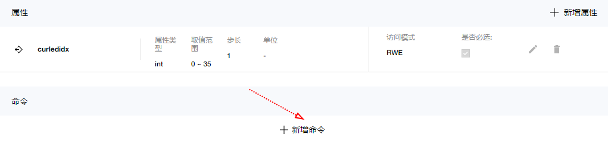

- 此命令是IoT平台下发命令，可设置广告牌显示某个字符。

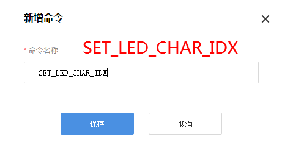

- 增加此命令的属性字段。

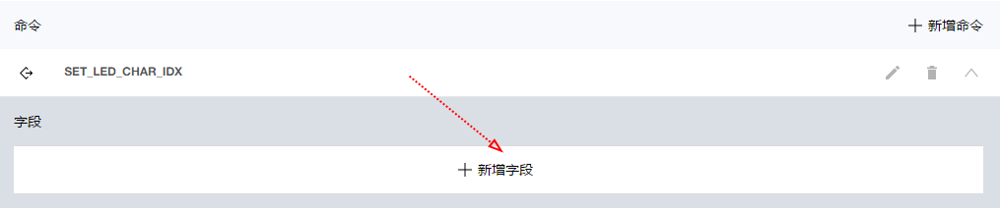

- IoT平台可设置广告牌，显示 0 ~ 35之间的某个字符。

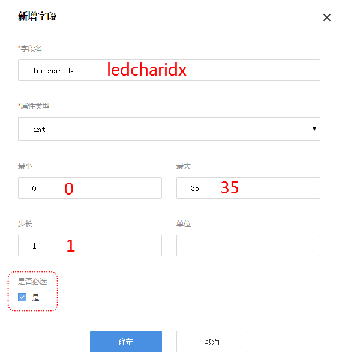

- 确定后，完成此条服务的所有定义。

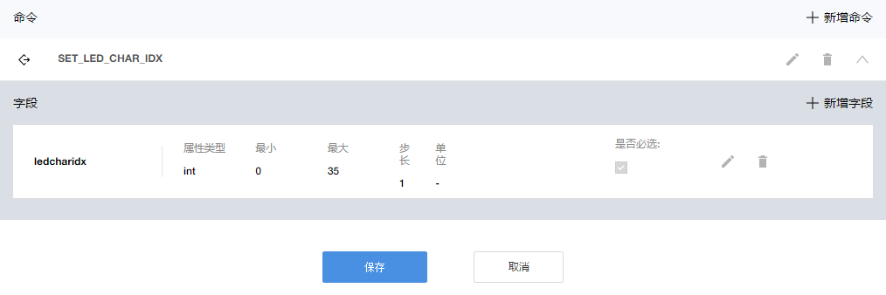

- LedChar这个服务，具有一条属性，一条下发命令。

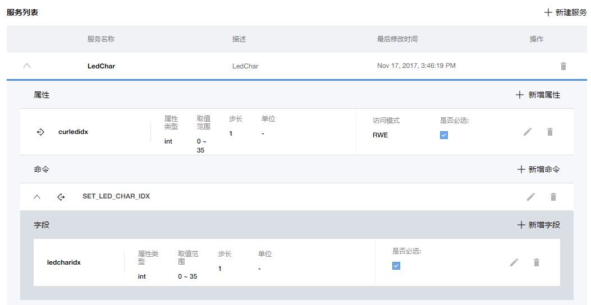

- 新增LED广告牌的第2个服务。

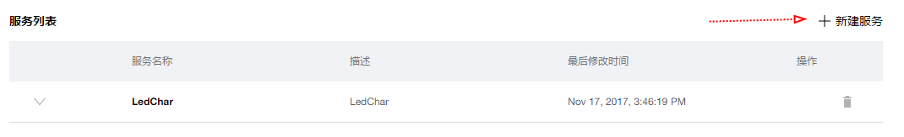

- 添加一条CharRoll的服务。请根据图片红色提示字符，自行添加。

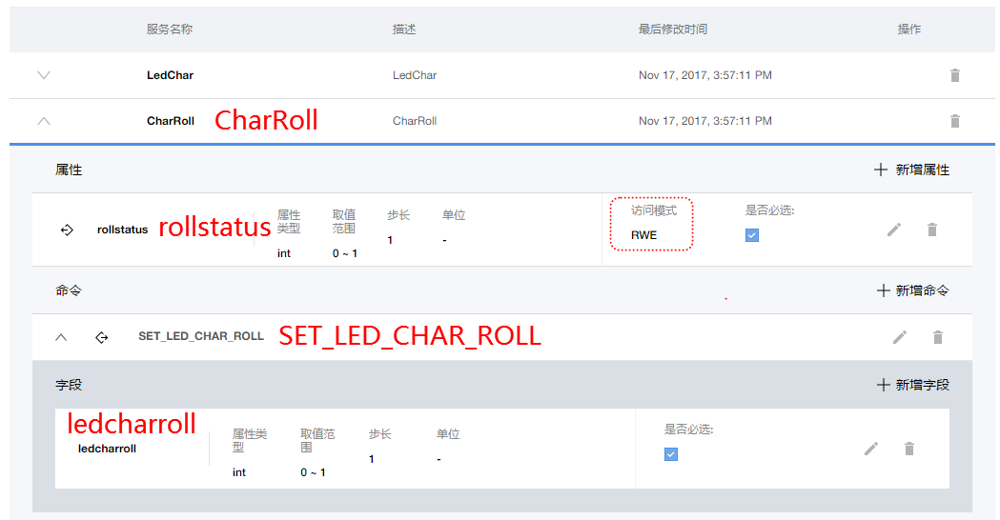

- 至此，完成profile文件的制作。

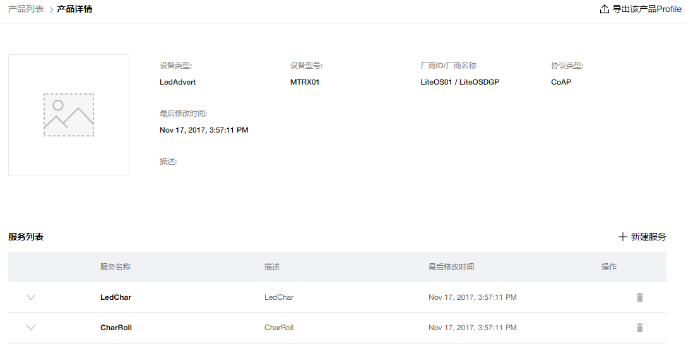

<h3 id="2">2.导入profile</h3>

- 左侧导航栏，点击“导入Profile”。

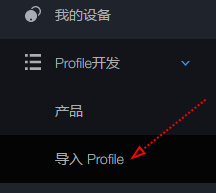

- Profile文件下载链接： [LedAdvert_LiteOS01_MTRX01.zip](../code/LedAdvert_LiteOS01_MTRX01.zip)  下载后，点击导入。

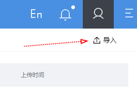

- 点击选择文件，其他内容默认自动填写。

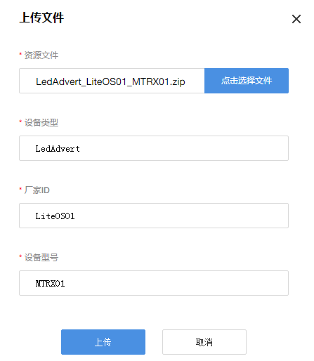

- 至此，profile导入完成。

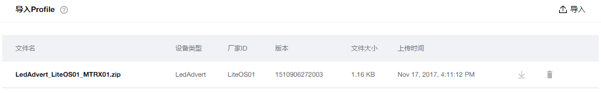
