## 背景说明

	跟我学制作Profile

## 制作profile

* [1.登陆OceanConnect平台](#1)
* [2.创建全新产品](#2)
* [3.新建服务](#3)
* [4.新增属性](#4)
* [5.新增命令](#5)
* [6.导出该产品Profile](#6)

<h3 id="1">1.登陆OceanConnect平台</h3>

	浏览器：chrome 【推荐】
	登陆网址  https://218.4.33.72:8093
	注意：网址可能会变化，详细内容请见OceanConnect账号开通的邮件“平台portal链接”。

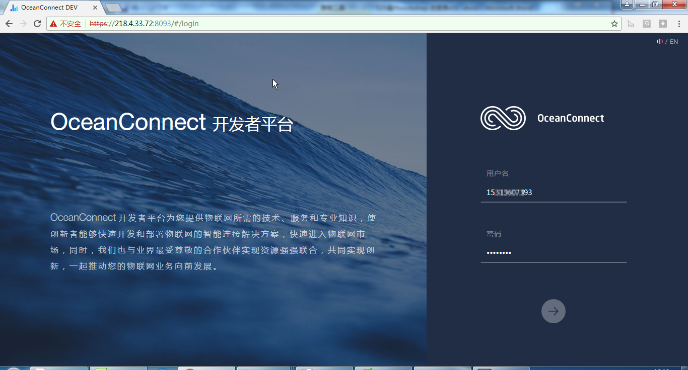
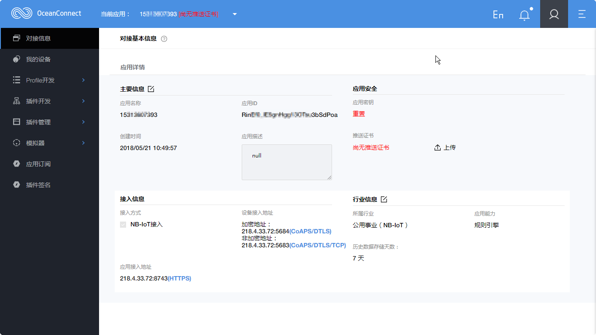
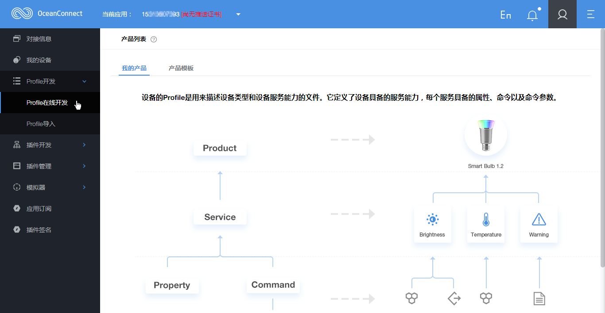

<h3 id="2">2.创建全新产品</h3>

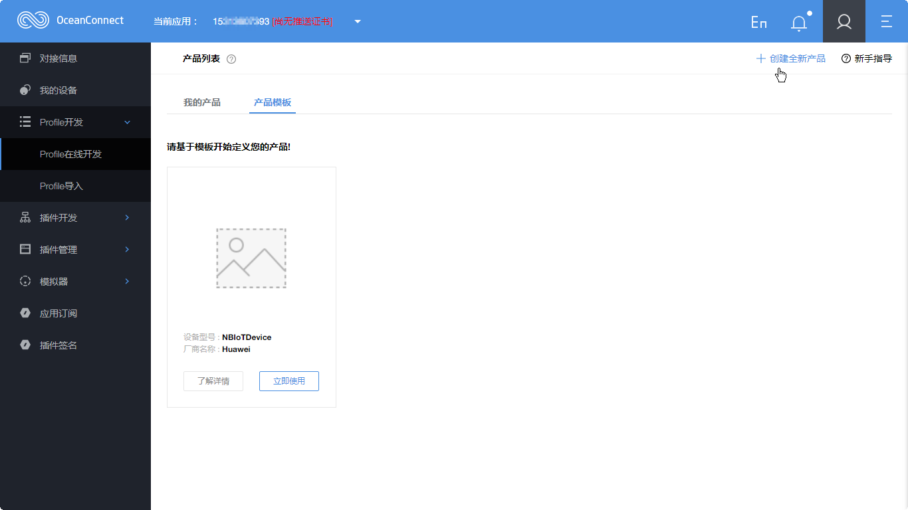

- 【注意】设备型号、厂商ID、厂商名称，请保证唯一性。例如：HuaweiOneLight***。后面3个星，可由各支队伍的数字编号构成。

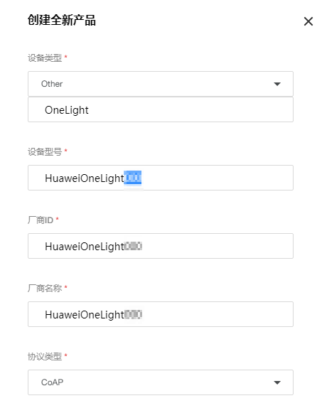
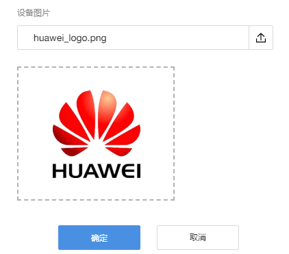
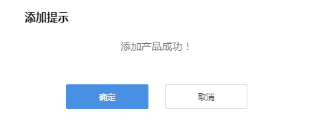

<h3 id="3">3.新建服务</h3>

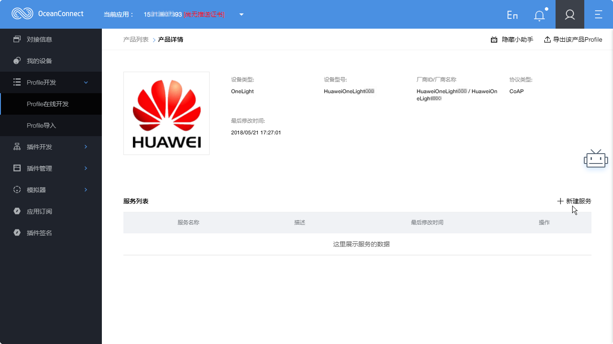
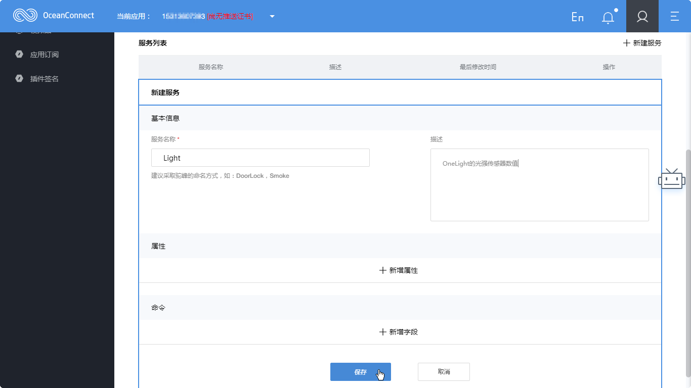

<h3 id="4">4.新增属性</h3>

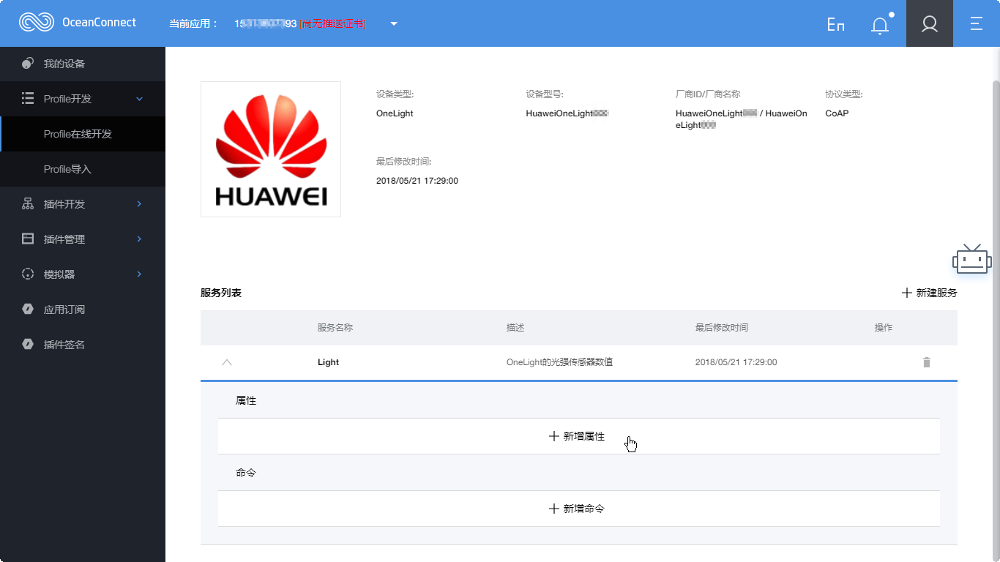

<h3 id="5">5.新增命令</h3>

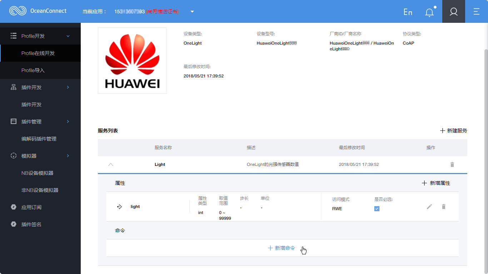
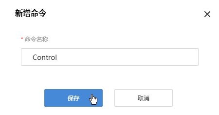
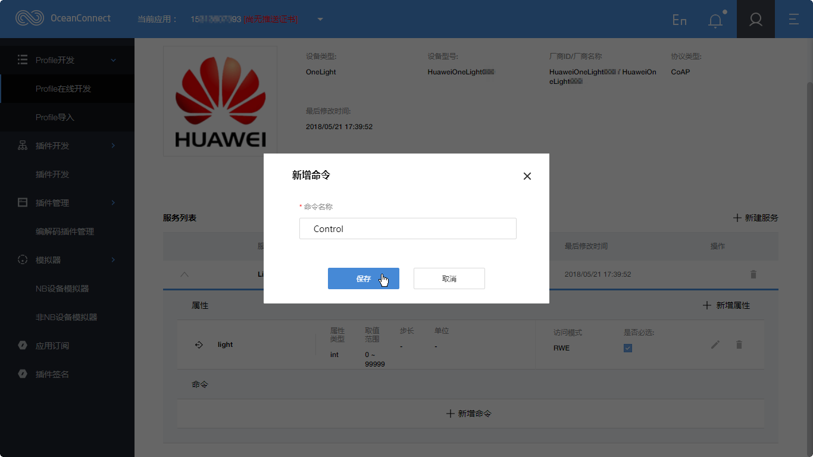

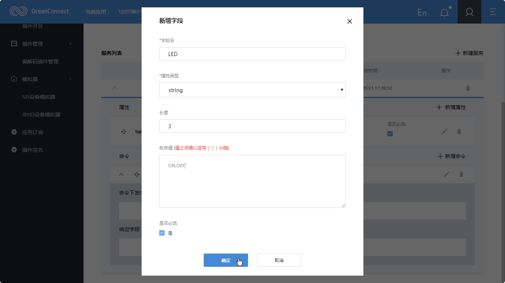

<h3 id="6">6.导出该产品Profile</h3>

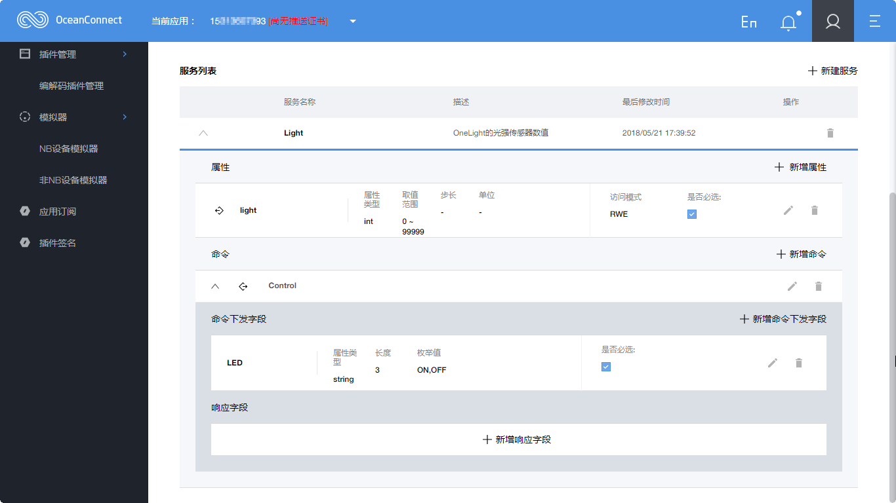

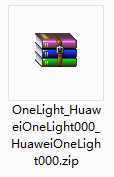

- 至此，完成Profile的制作。

附：Huawei Logo

