## 背景说明

	跟我学在线制作编解码插件

## 制作profile

* [1.插件开发，开始设计](#1)
* [2.新手教程](#2)
* [3.新增消息](#3)
* [4.数据上报](#4)
* [5.数据上报映射Profile](#5)
* [6.命令下发](#6)
* [7.命令下发映射Profile](#7)
* [8.保存插件](#8)
* [9.部署插件](#9)
* [10.完成在线制作编解码插件](#10)

<h3 id="1">1.插件开发，开始设计</h3>

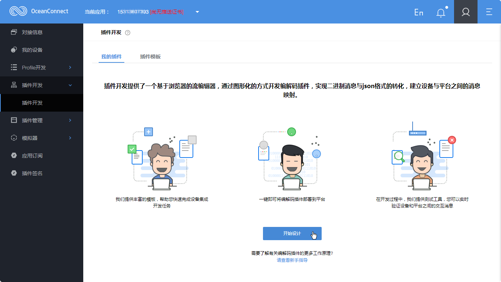
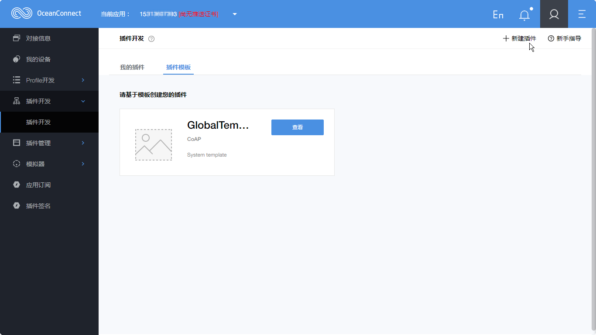
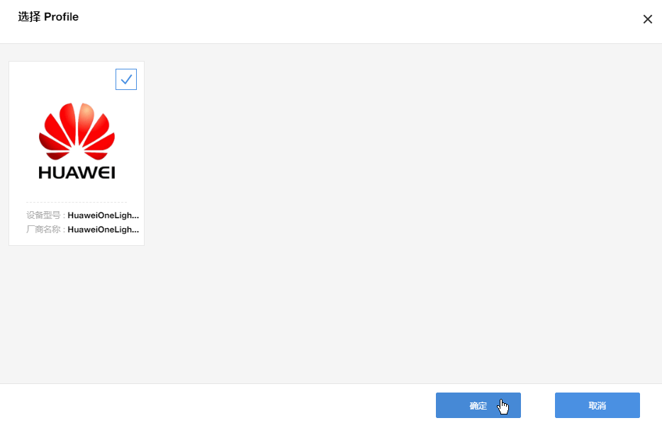

<h3 id="2">2.新手教程</h3>

<h3 id="3">3.新增消息</h3>

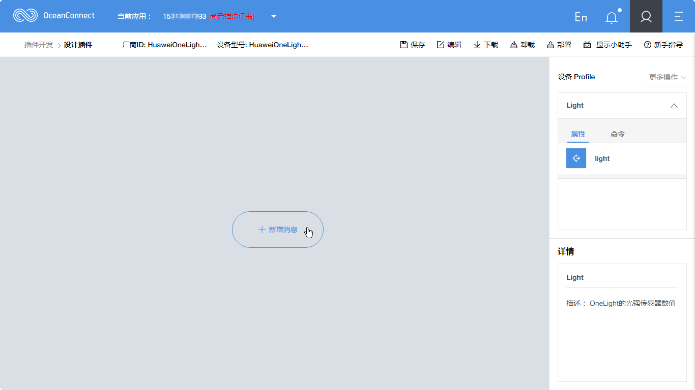

<h3 id="4">4.数据上报</h3>

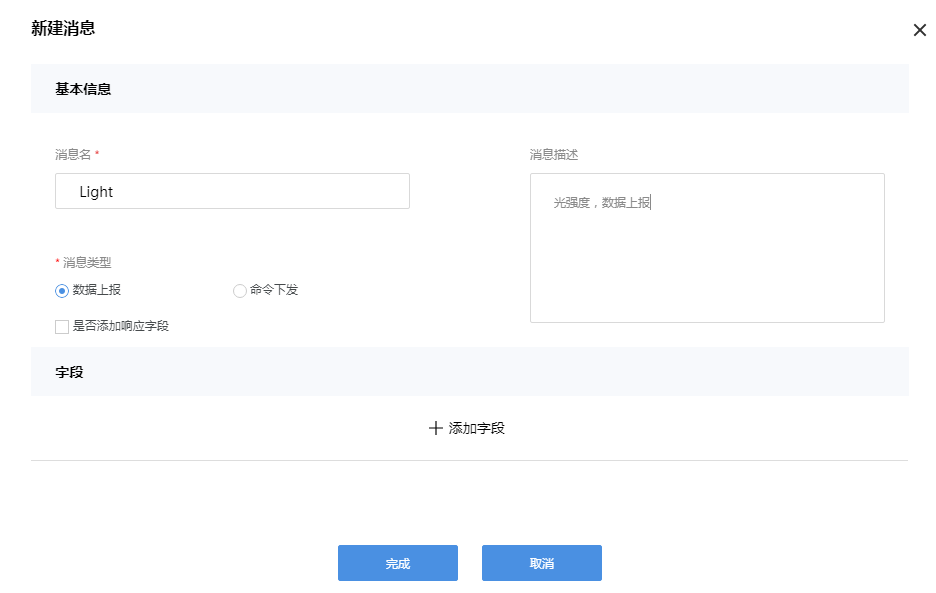
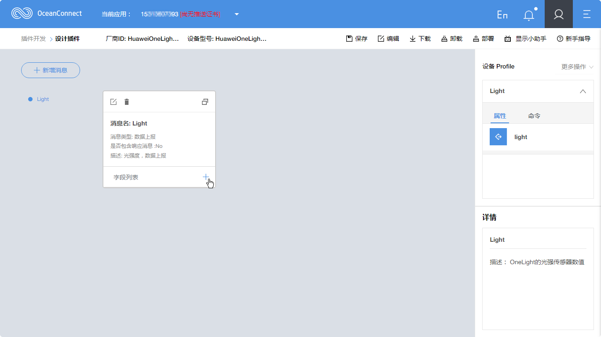

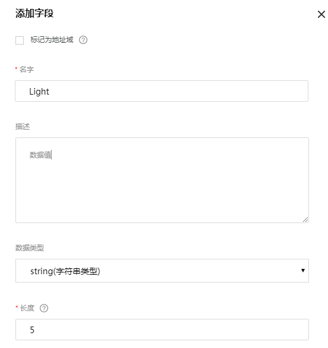

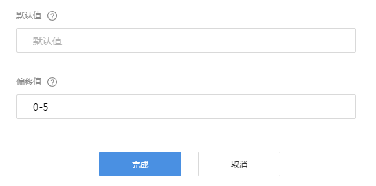

<h3 id="5">5.数据上报映射Profile</h3>

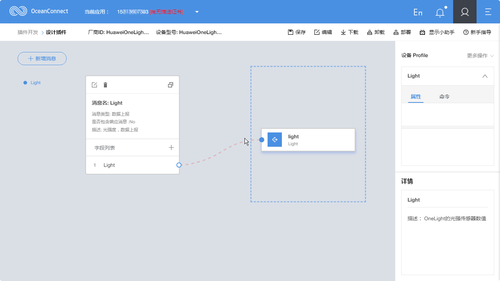
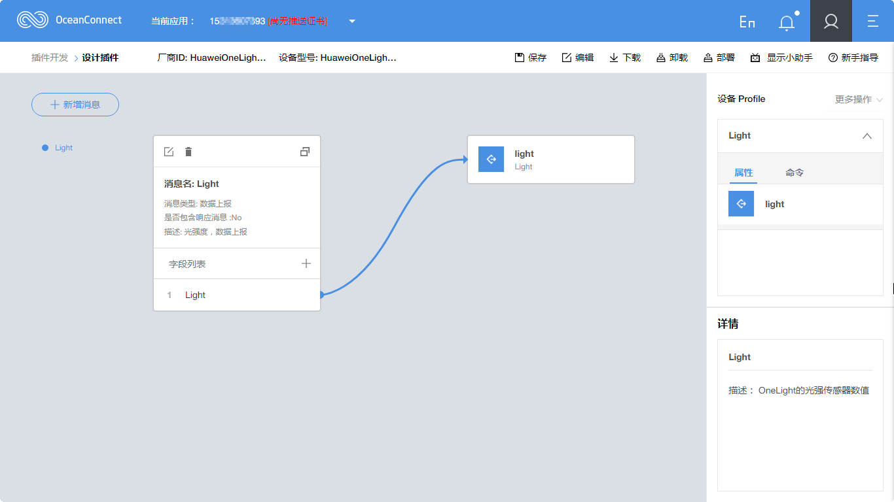

<h3 id="6">6.命令下发</h3>

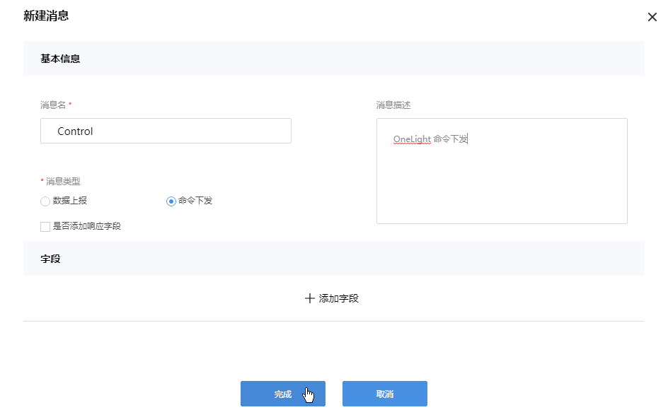
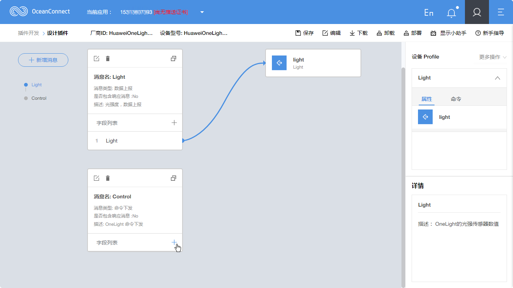

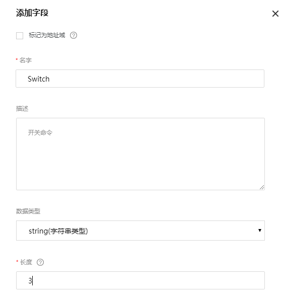

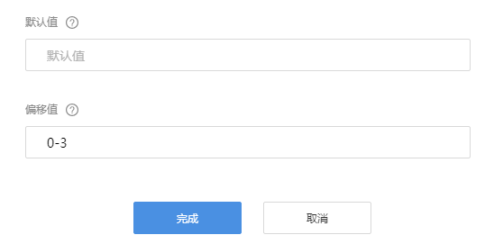

<h3 id="7">7.命令下发映射Profile</h3>

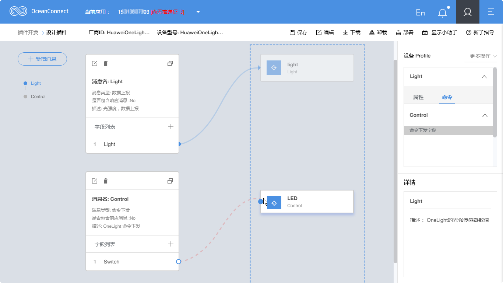

<h3 id="8">8.保存插件</h3>

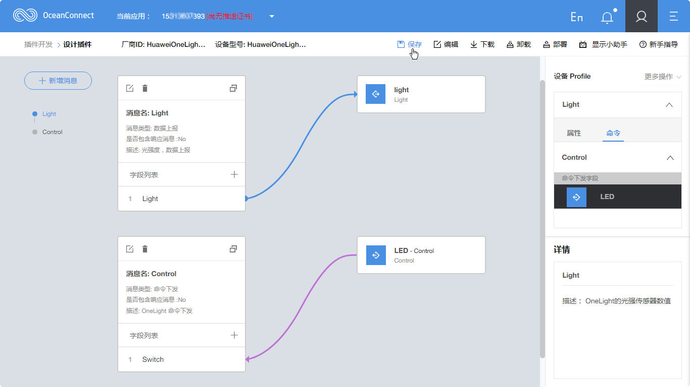

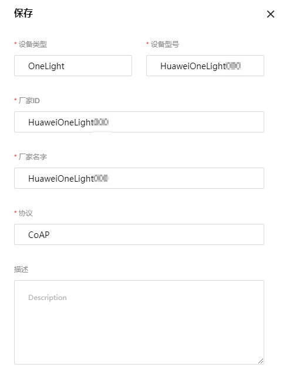

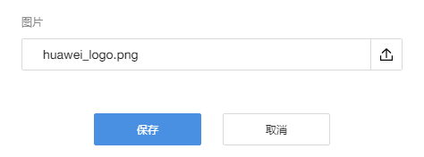

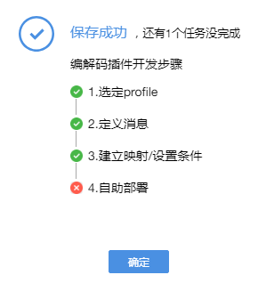

<h3 id="9">9.部署插件</h3>

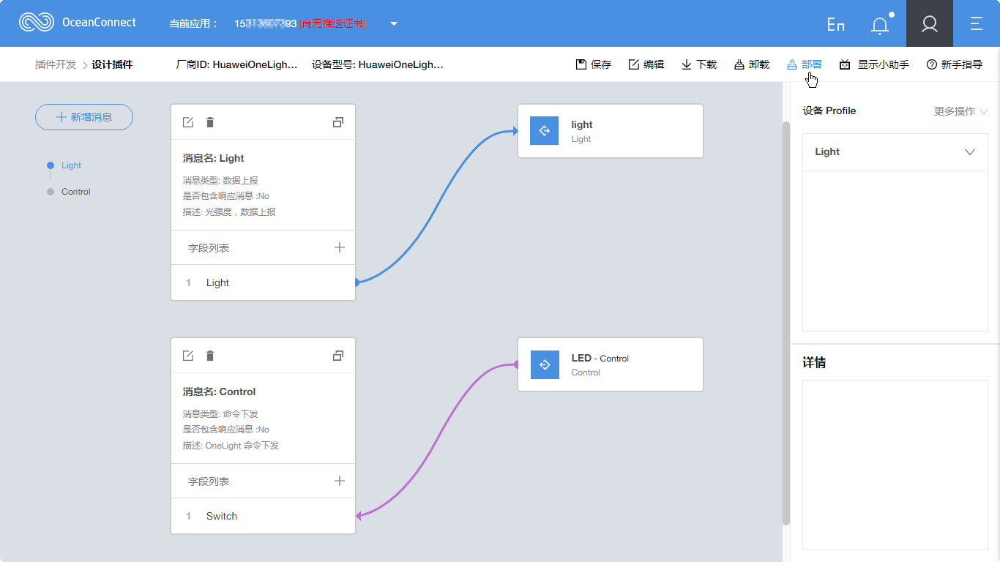

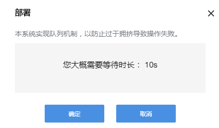

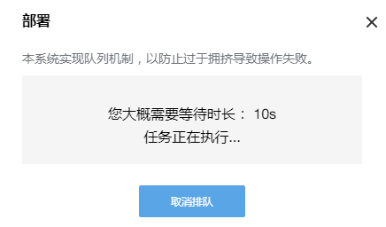

<h3 id="10">10.完成在线制作编解码插件</h3>

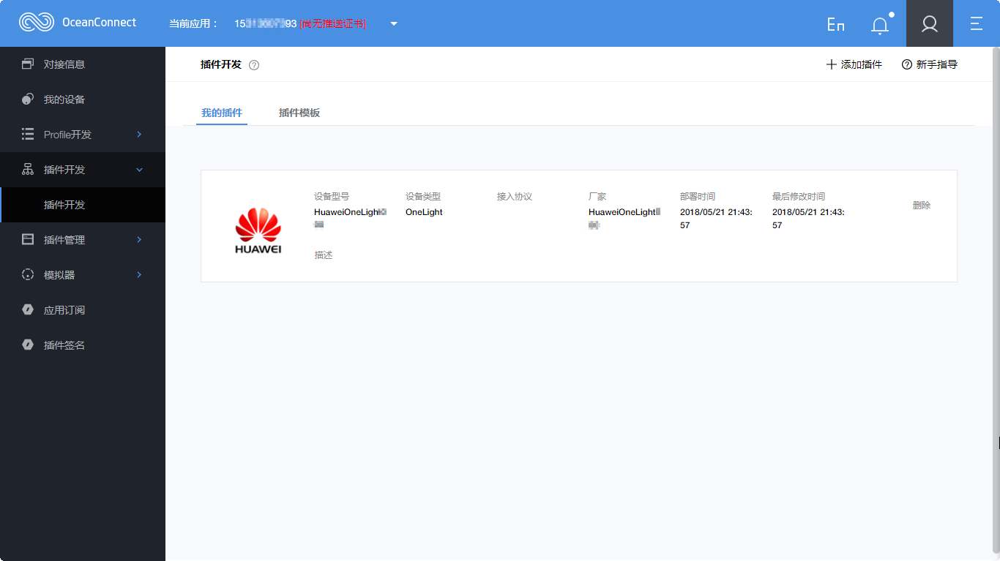
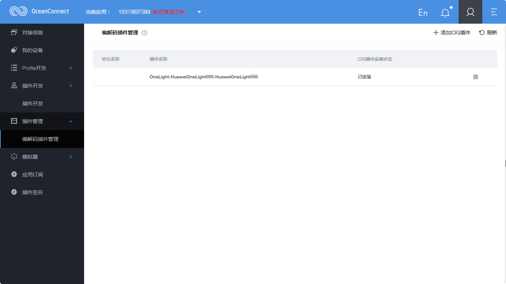

