## 背景说明

	跟我学在线模拟NB设备，目的是验证咱们设计的Profile和编解码插件在云平台上运行正常。

## 在线模拟NB设备

* [1.注册模拟设备](#1)
* [2.查看模拟设备详情](#2)
* [3.模拟器绑定设备](#3)
* [4.发送数据](#4)
* [5.查看模拟设备历史数据](#5)
* [6.命令下发](#6)
* [7.查看模拟设备历史命令](#7)

<h3 id="1">1.插件开发，开始设计</h3>

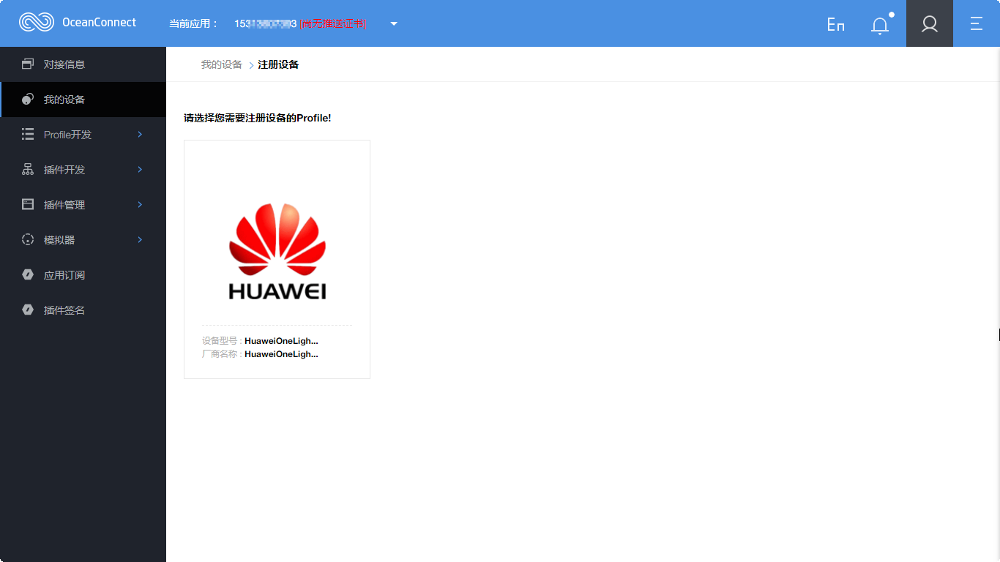
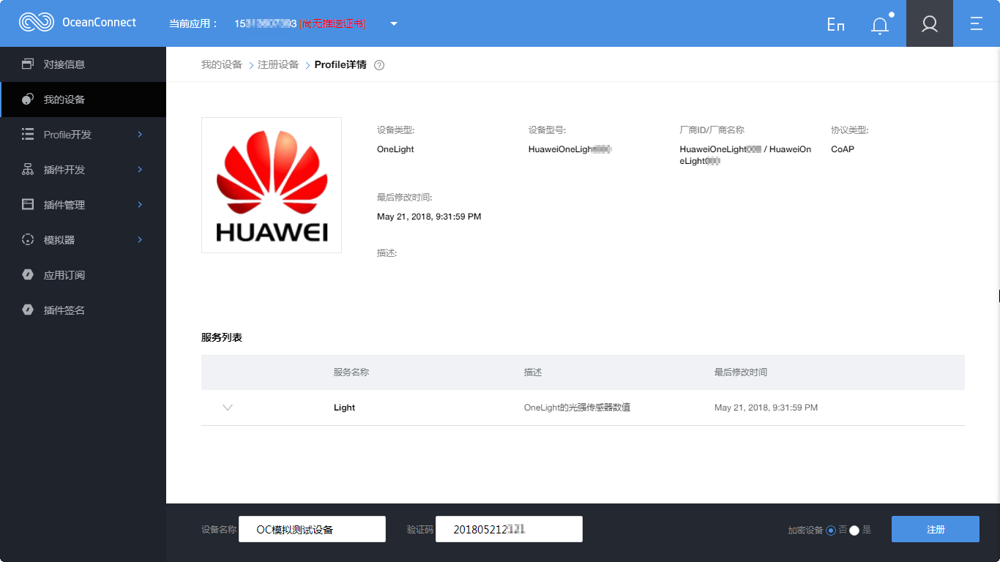
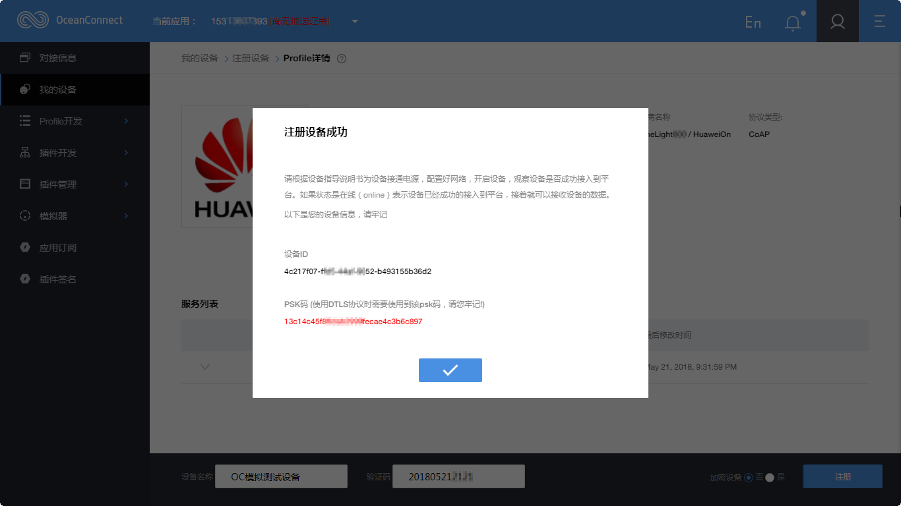

<h3 id="2">2.查看模拟设备详情</h3>

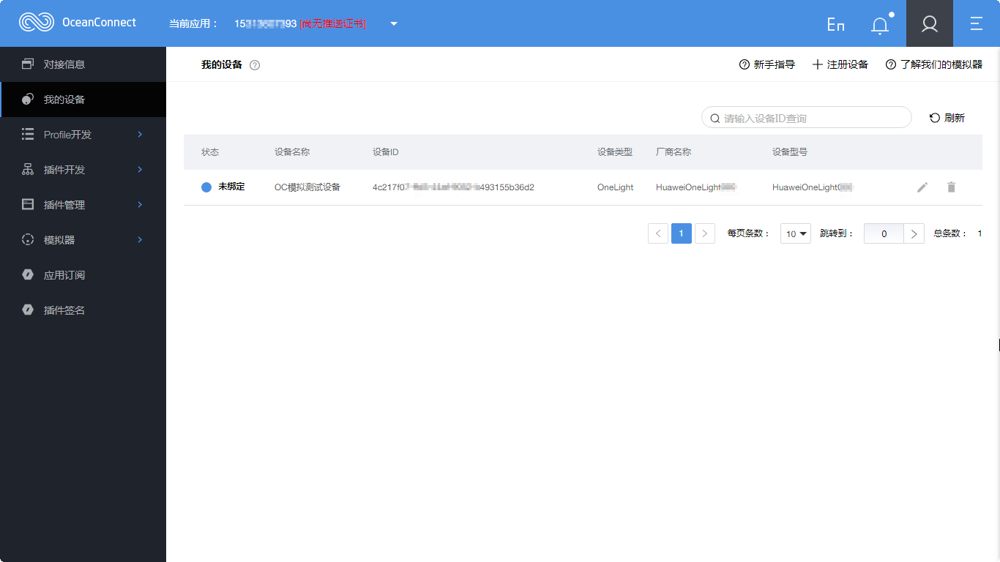
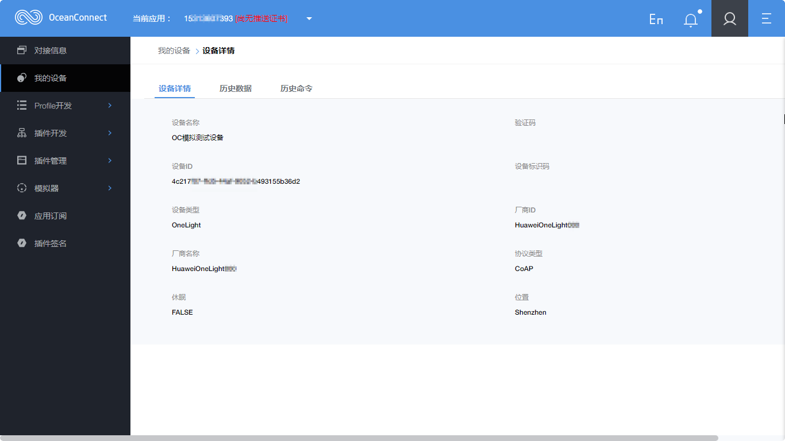
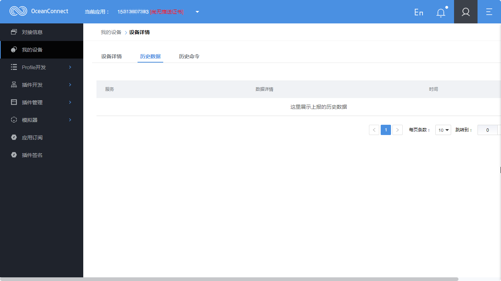
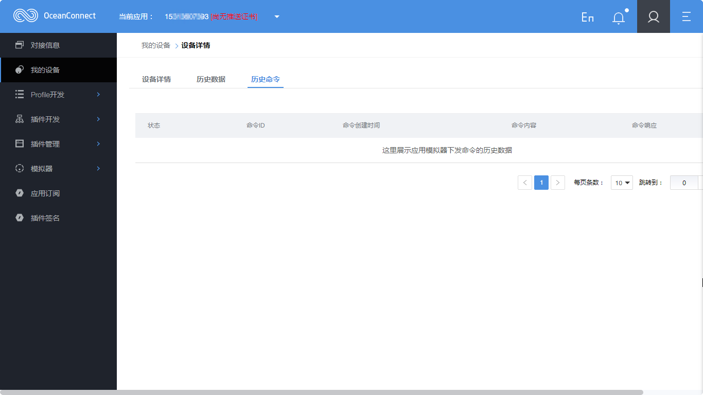

<h3 id="3">3.模拟器绑定设备</h3>

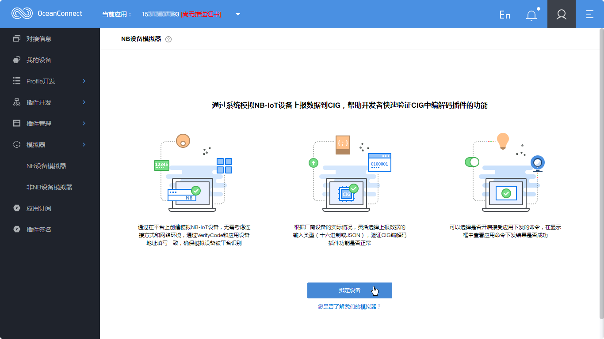

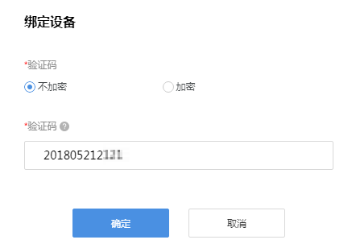

<h3 id="4">4.发送数据</h3>

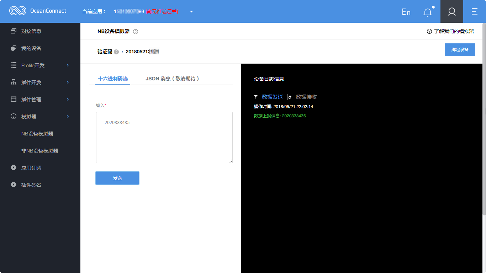

<h3 id="5">5.查看模拟设备历史数据</h3>

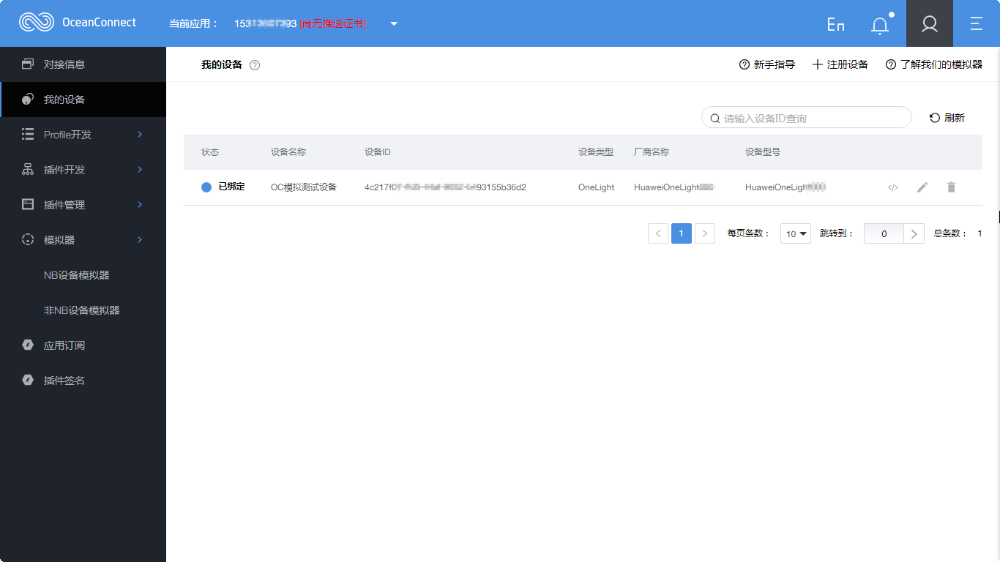
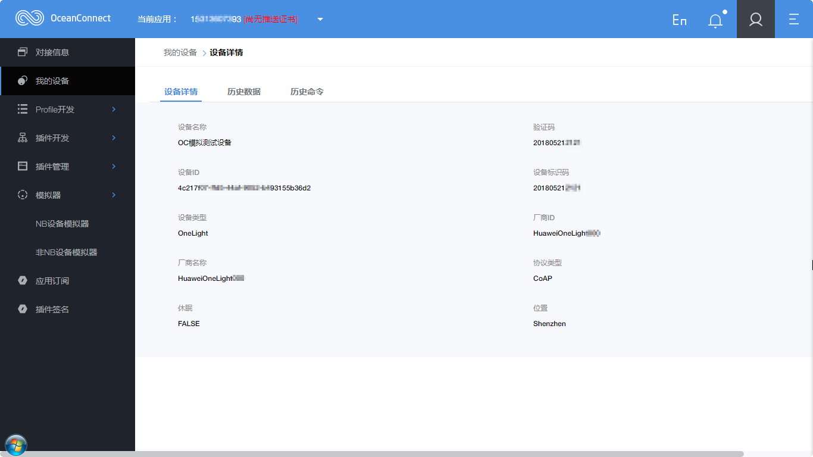

<h3 id="6">6.命令下发</h3>

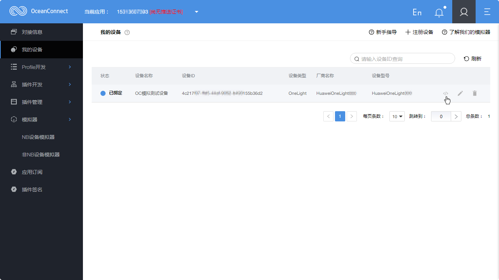
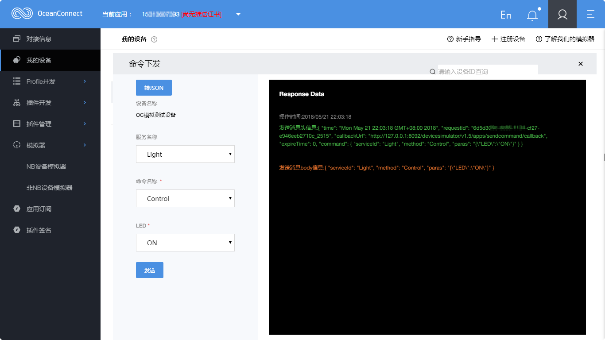

<h3 id="7">7.查看模拟设备历史命令</h3>

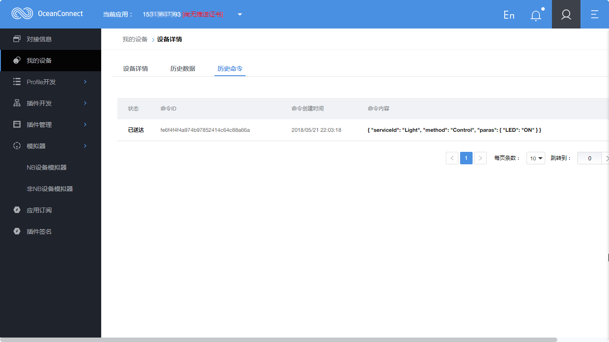

- 至此，验证完成Profile和编解码插件。
